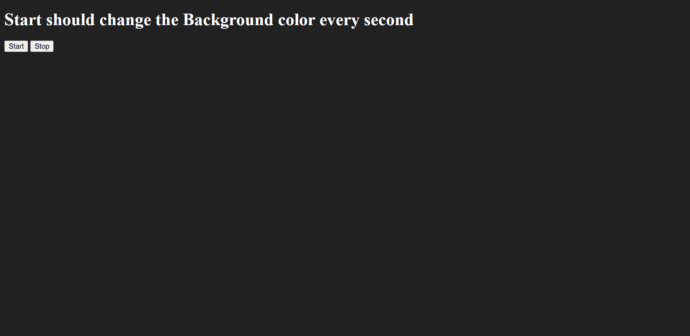

# Background Color Changer

This is a simple JavaScript project that demonstrates how to change the background color of a webpage dynamically at regular intervals.  

When the **Start** button is clicked, the background color changes every second to a random color.  
When the **Stop** button is clicked, the background color change stops.

---

## 🚀 Features
- Start and stop buttons to control the background color changes.
- Background color updates every **1 second** when running.
- Uses `setInterval()` and `clearInterval()` for interval handling.
- Simple and easy-to-understand JavaScript code.

---

## 🛠️ Technologies Used
- **HTML** – Structure of the webpage
- **CSS** – Basic styling
- **JavaScript** – Logic for color changing and event handling

---

## 📂 Project Structure
├── index.html # Main HTML file
└── script.js # JavaScript logic

---

## 📜 How It Works
1. Click **Start** → triggers a `setInterval()` function that changes the background color every 1 second.
2. Random colors are generated using JavaScript.
3. Click **Stop** → `clearInterval()` stops the background color change.

---

## 💻 Demo
When you open the project in your browser:
- Click the **Start** button → background color changes every second.
- Click the **Stop** button → background color stops changing.

---

## 🖼️ Screenshot

---

## 📌 Future Improvements
- Add a color palette mode (e.g., pastel colors only).
- Add an option to control speed (500ms, 1s, 2s, etc.).
- Display the current hex/rgb color code on screen.

---

## 👩‍💻 Author
- Created by **Ankita** 🌸  
- Learning JavaScript and Frontend Development 🚀
